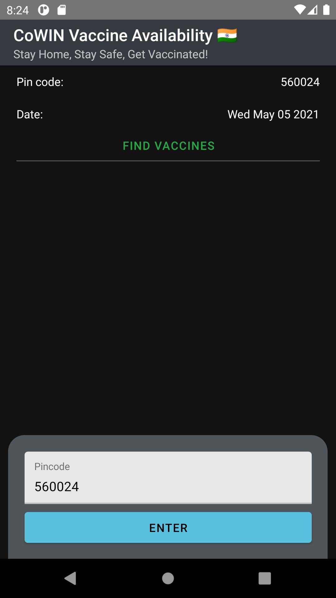
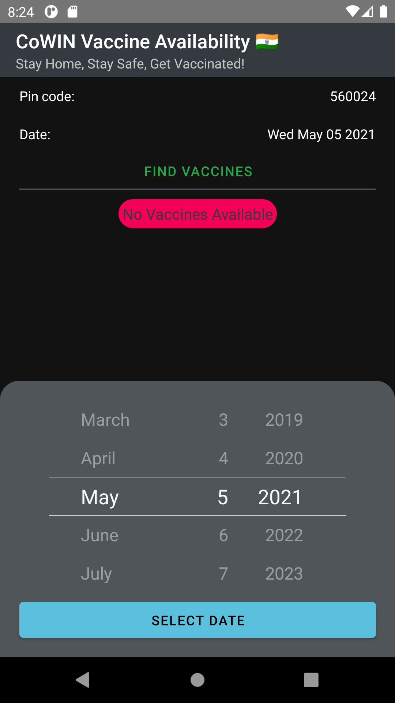
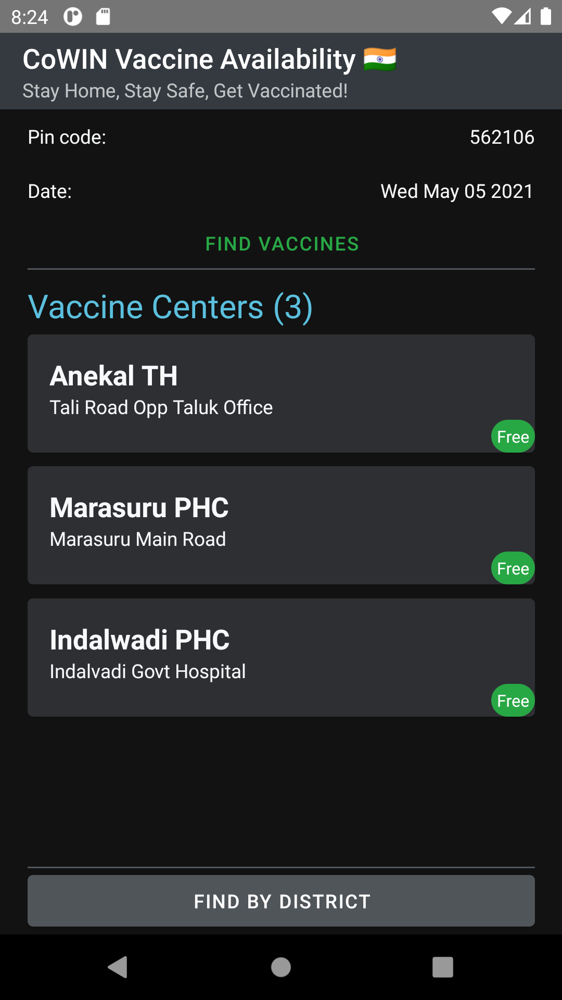
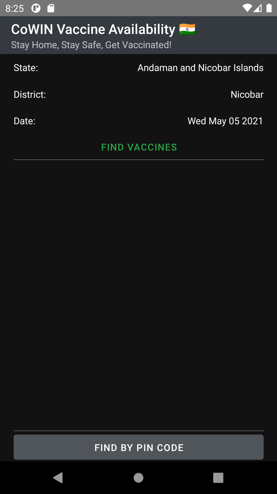
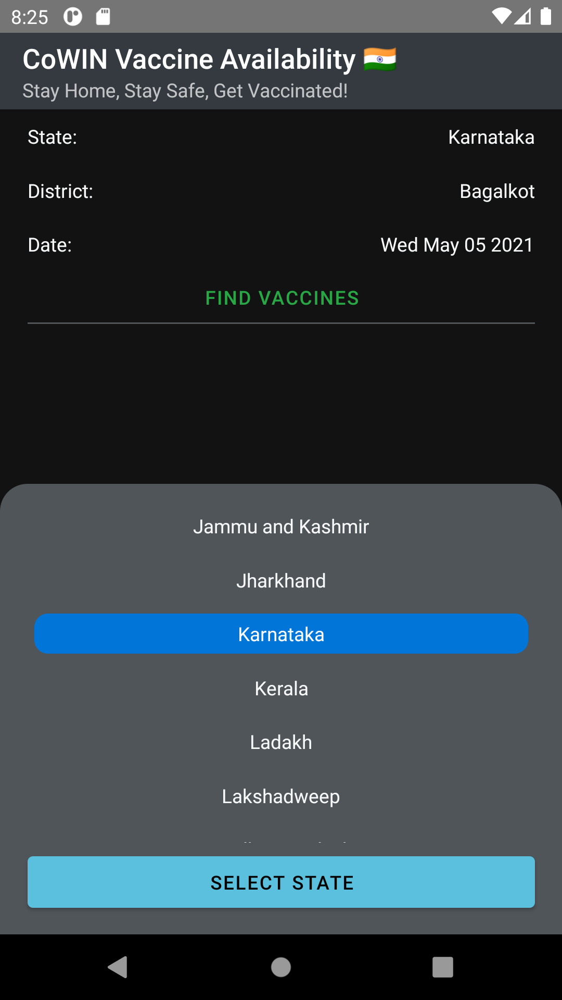
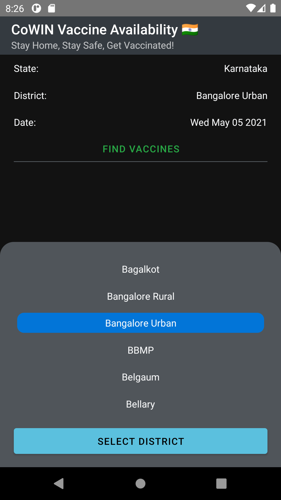
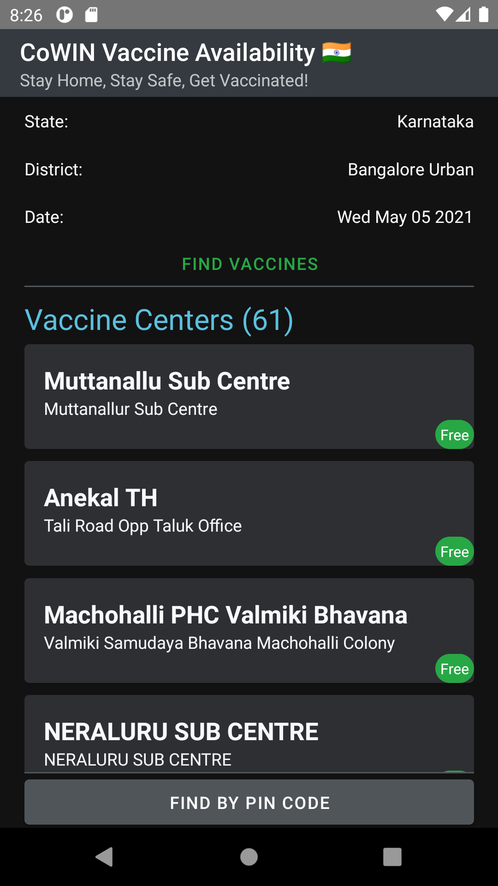
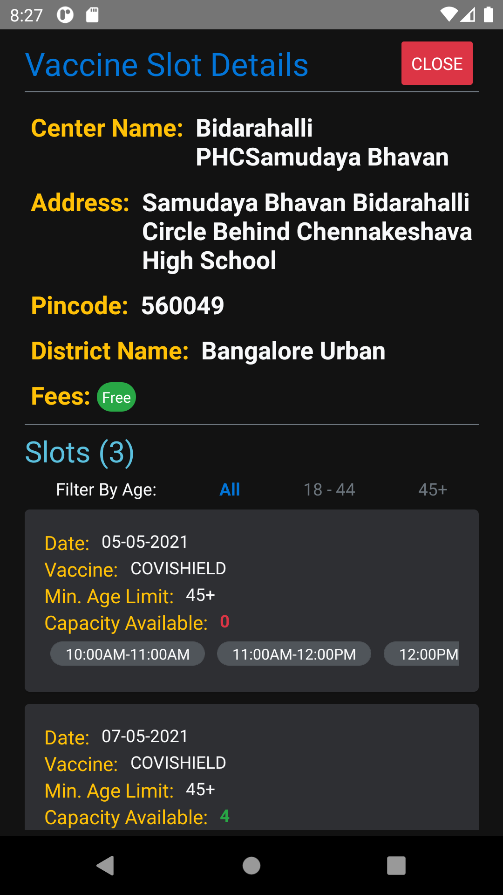

# CoWIN Vaccine Availability

> > Simple app that fetches the data for vaccine availability based on pincode or district provided by the user. It is built using React Native and [cowin api](https://apisetu.gov.in).

### Screenshots

<h6>
#1 Enter Pin Code | #2 Select Date | #3 #4 Find By Pin(results) | #5 Find By District | #6 Select State | #7 Select District | #8 Find By District(results) | #9 Vaccine Slot Details
</h6>

